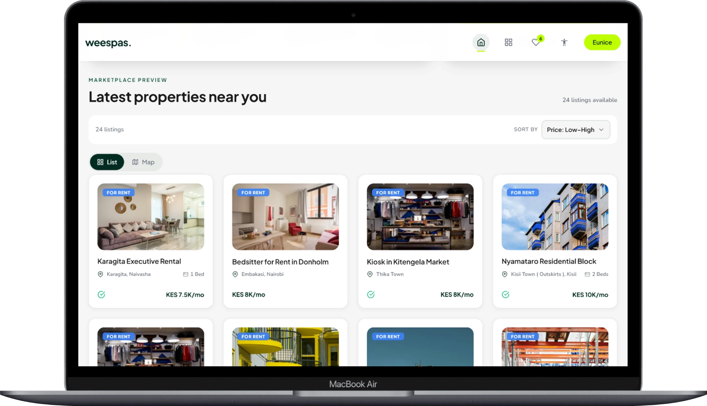
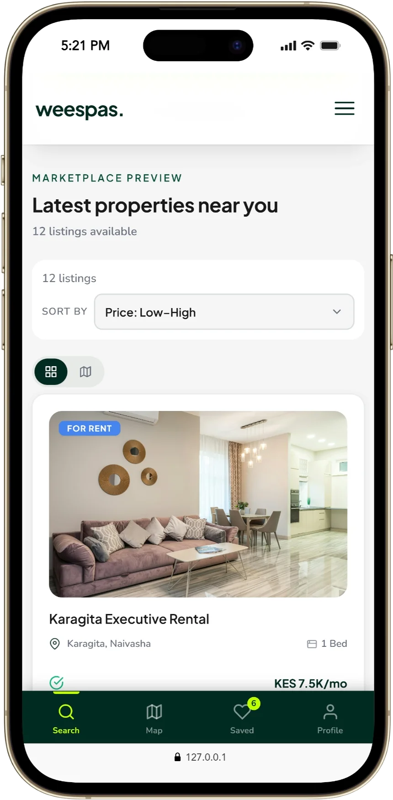
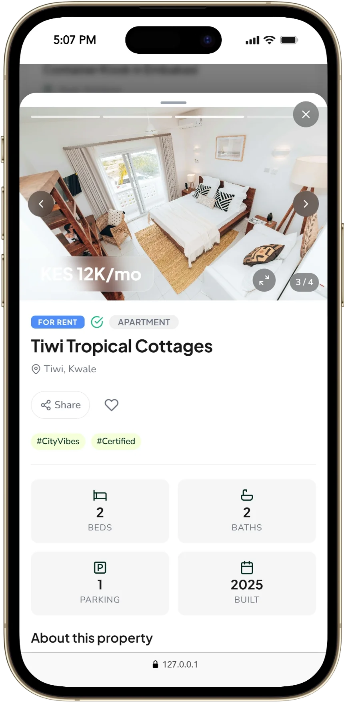
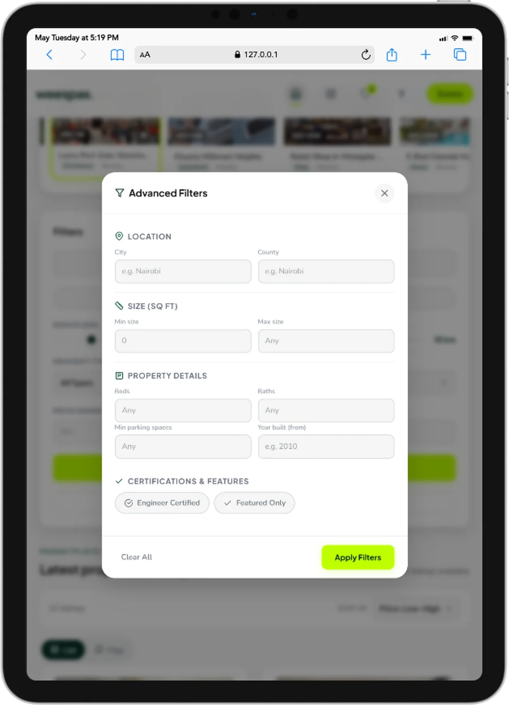
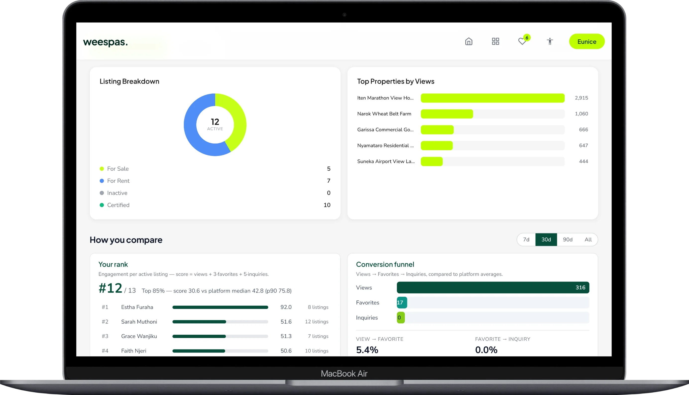
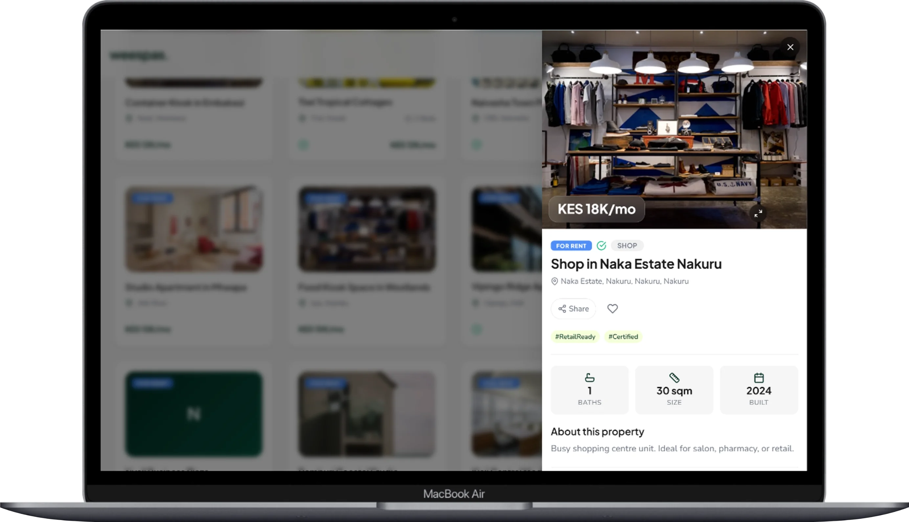

# 🚀 Project Name: Weespas UI/UX Concept

> **Role:** Lead UI/UX Designer | **Tools:** React, Type-Script, FastAPI 

---

## 📱 Responsive Design Overview
| Desktop View (Main Dashboard) | Tablet View | Mobile View |
| :---: | :---: | :---: |
|  |  |  |

---

## 🔍 Feature Deep-Dive

### User Journey & Analytics
Below are the specific gadget views highlighting DETAILS, FILTERS and ADMIN STATS views.

| Property Details (Mobile) | Search Filters (Tablet) |
| :---: | :---: |
|  |  |

| STATS VIEW ( DESKTOP ) | Property Details(DESKTOP ) |
| :---: | :---: |
|  |  |
